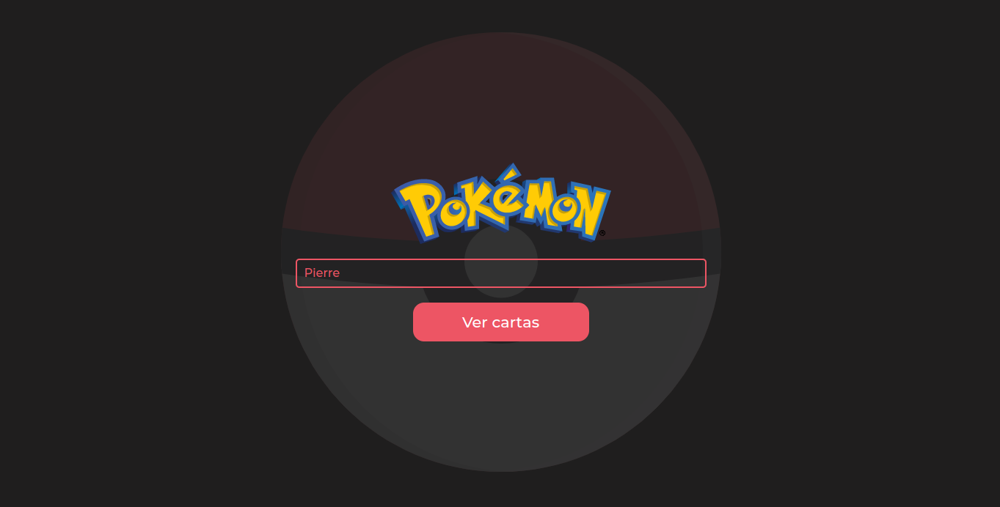
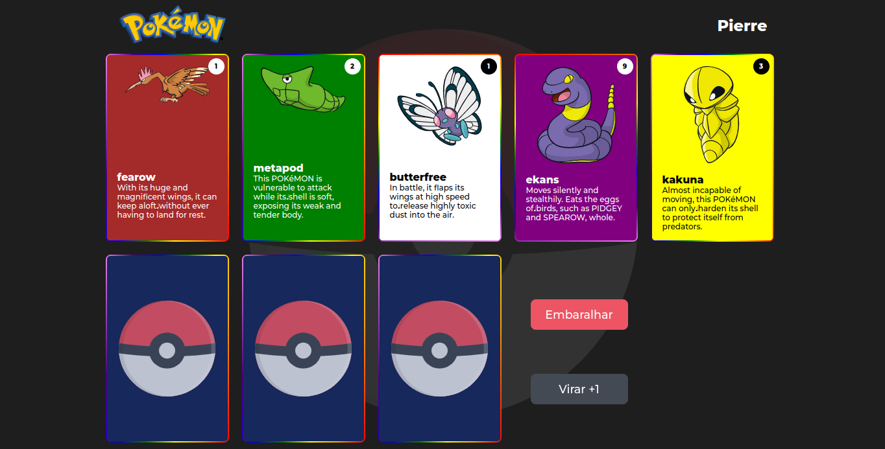
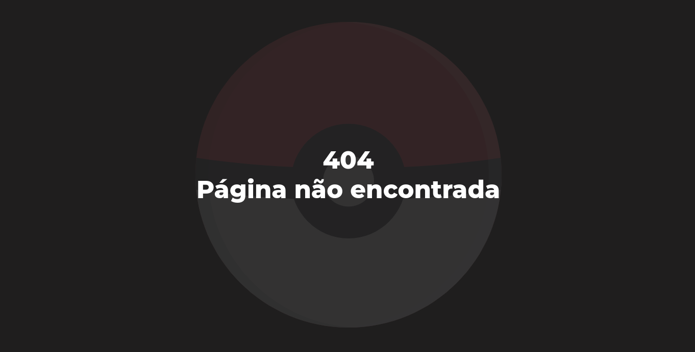

# PokeCards

	

## Descrição

Este é um simples site feito em React para demonstração das minhas habilidades. Na sua tela inicial é preciso preencher um input com algum nome e em seguida clicar no botão ver cartas. Na segunda tela irá visualizar 5 cartas preenchiadas a partir da [POKEAPI](https://pokeapi.co/) e mais 3 cartas viradas. Pode-se manusear com dois botões, um é para virar uma das 3 cartas podendo ser clicado apenas 3 vezes e o outro botão é para embaralhar a ordem das cartas exibidas. Caso queira testar o site, clique [aqui](https://pokecards-pierreoliveira1.vercel.app/).

## Instalação

1. Clonar repositório `git clone https://github.com/PierreOliveira1/pokecards.git`
2. Executar `npm install` ou `yarn install` ou ` pnpm install`, use o que for de sua preferência.
3. Por fim executar `npm run dev` ou `yarn dev` ou `pnpm dev` e abrir o host que aparecerá no terminal.

## Estrutura

A estrutura do projeto é baseado em módulos independentes, onde cada tela tem seus próprios componentes, estilos, entre outros... Mas também existem os estilos globais por exemplo, onde mais de uma tela/módulo usa. Assim também poderia ter componentes globais e entre outros.

## Imagens

